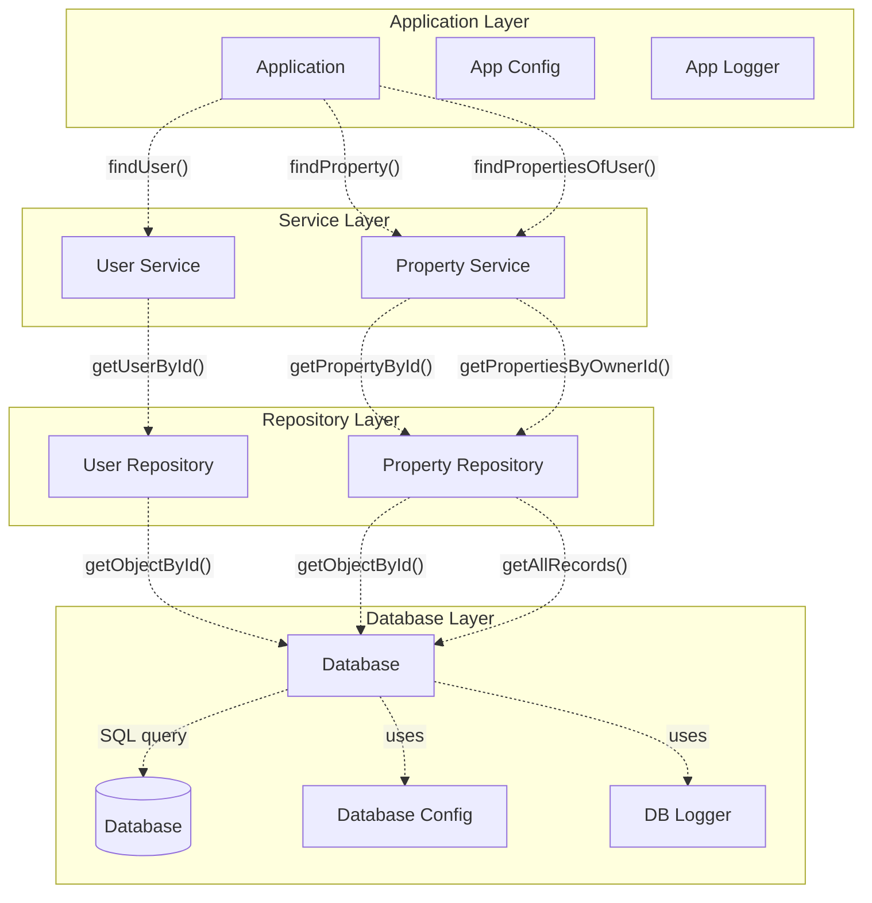

# How to use ZLayers in a ZIO 2.0 Application

This is the Scala project for the [Hivemind Technologies](http://hivemindtechnologies.com) blog article about ZIO
Layers (_ZLayers_).
You can find
the [article in this link](https://github.com/HivemindTechnologies/zlayers-article/blob/main/zlayers-article.pdf).

## Architecture of the Application

The application is structured in 4 different layers:

* Application
* Service
* Repository
* Database



## Provided SBT commands

### Clean project files

This will clean the compilation files (_*.class_) from the project:

```bash
sbt clean
```

### Formatting all project files

The following command with format all the Scala files (_*.scala_) according to the scala format file provided in the
project (_.scalafmt.conf_)

```bash
sbt fmt
```

### Compiling the project files

The following command will compile the main project files:

```bash
sbt compile
```

### Running the tests

This will execute all the tests in the project:

```bash
sbt test
```

### Clean, format, compile, and run the tests in the same command

The `sbt check` command will execute the following steps:

1. Clean all compilation files (_*.class_)
2. Format all project files
3. Compile all project files (including test classes)
4. Execute all the tests

```bash
sbt check
```

