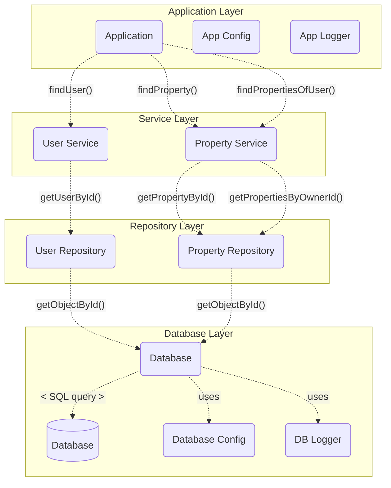

# How to use ZLayers in a ZIO 2.0 Application

This is the Scala project for the Hivemind Technologies blog article about ZIO Layers (_ZLayers_).
You can find the [article in this link](http://hivemindtechnologies.com).

## Architecture of the Application




## Provided SBT commands

### Compiling the project

```bash
sbt check
```

### Formatting all project files

```bash
sbt fmt
```

### Running the tests

```bash
sbt test
```
